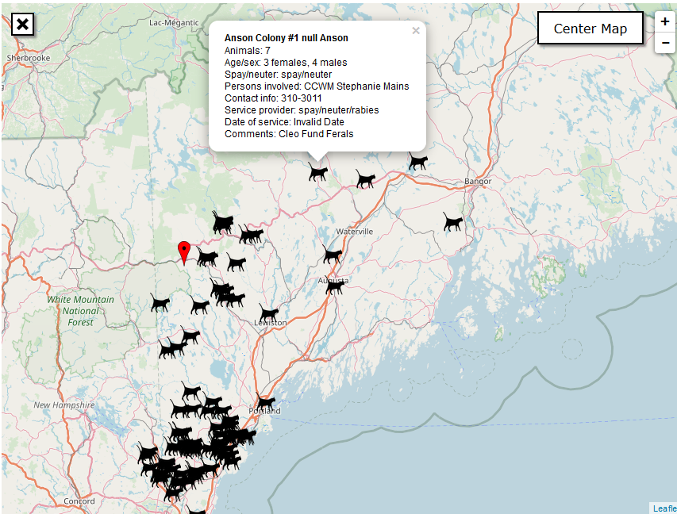

# AWS Colony Map
Map-based data visualization of feral cat colony projects for the state of Maine.

Data extent includes caretakers, animal population, and services offered.
A project for the benefit of the Animal Welfare Society of Kennebunk Maine.

## Tech Stack
 - [Heroku-hosted] (https://awsmap.herokuapp.com/)
 - Excel/s3 hosted data source
 - Angular
 - Express 4
 - Node-js
 - jade template engine
 - aws sdk
 - Nominatim geocoding
 - OpenStreetMaps/leaflet

## Data flow
AWS administrators maintain an excel workbook housed within a fixed location on an S3 bucket. This application, by means of an asynchronous server-side request,
fetches the excel workbook and parses the structure into a 2d data array. The client in turn recovers the data and populates dynamic pushpins on a map canvas.
